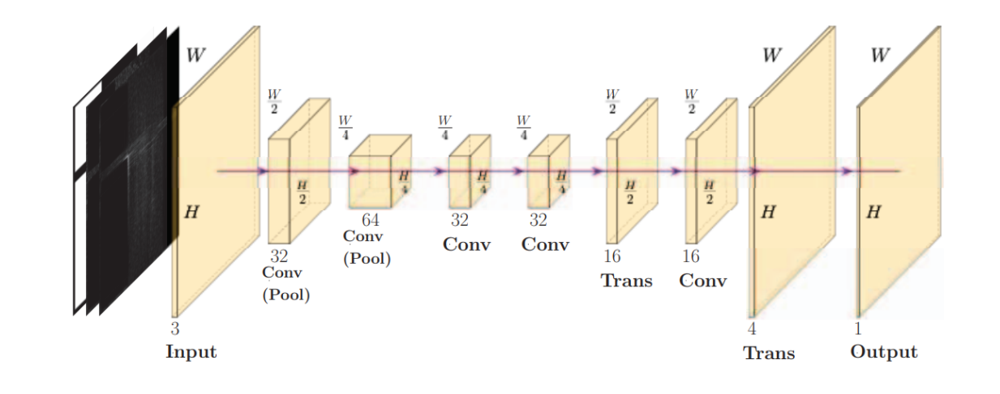
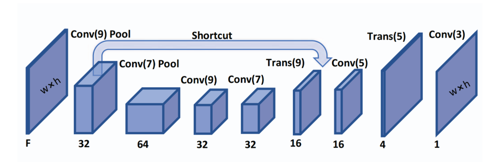
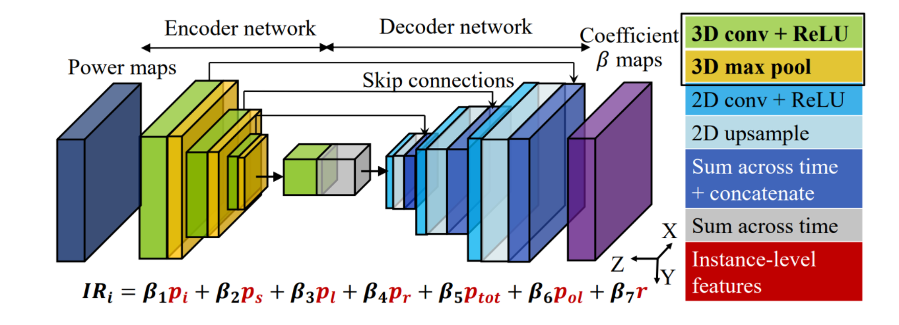
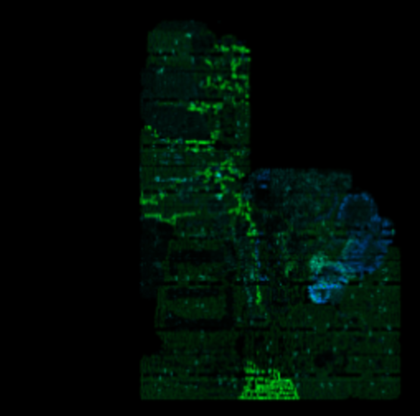
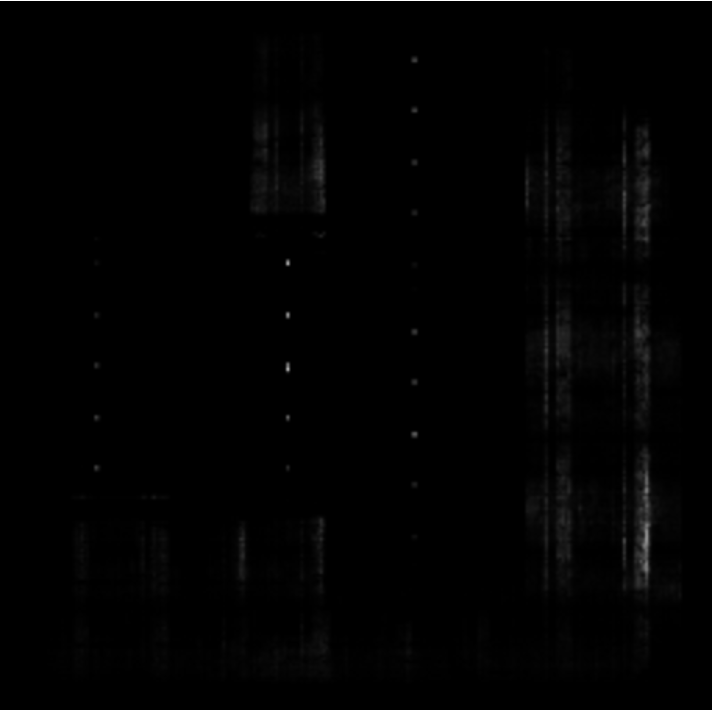
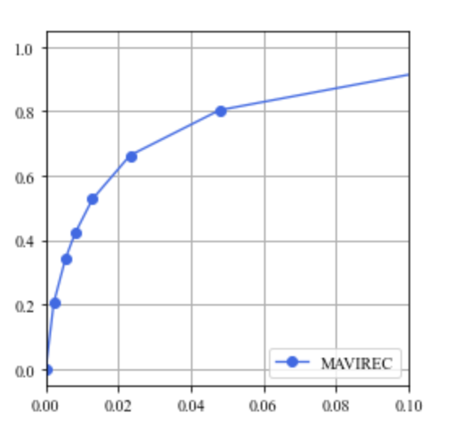

## Experiments&Benchmarks

------

Here, we select several representative methods to give a brief introduction to applying machine learning to VLSI physical design cycle that provides an intuitive awareness of the functionality and practicability of `CircuirNet` to users.

### Congestion Prediction

The network of `Global Placement with Deep Learning-Enabled Explicit Routability Optimization` uses an encoder and decoder architecture to translate the image-like features into a routing resource assumption heat map (congestion map). The architecture is shown below.

  

Three image-like features of RUDY, PinRUDY and MacroRegion were fed into the network to get the final congestion prediction. Here is the visualization of input features.

  

We train the network in an end-to-end manner and compute the loss between the output and the golden result obtained by Innovus global router. The visualization of output image is shown below after training convergence.

  

### DRC Violation

DRC Violation prediction is an essential step in the physical design procedure aiming at detecting violation hotspots at the early design stage, which is quite conducive to reducing the chip design turn-around. `RouteNet: Routability Prediction for Mixed-Size Designs Using Convolutional Neural Network` is a typical method for accurately detecting violation hotspots.

  

Nine features extracted at different stages of physical design flow are combined together as one input tensor.

  

<!-- 

  

 -->

After finishing the training phase, the prediction map can be specially demonstrated into a binary matrix, where the area greater than zero depicts the potential DRC violation in designing space.

  

ROC and PRC are also provided to measure the performance of the abovementioned method.

   

### IR Drop

IR Drop is another critical part of the whole design workflow that hugely affects the timing frequency and availability that needed to be carefully considered. `MAVIREC: ML-Aided Vectored IR-Drop Estimation and Classification` also cast the IR Drop prediction problem as an image-to-image translation task. Due to the demand for joint perception along the temporal and spatial axis, MAVIREC introduces a 3D encoder to aggregate the Spatio-temporal features and decode the prediction result into a 2D hotspot map.

  

Here is the visualization of input features.

  

The training phase is stopped after the network is sufficiently capable to generate a high-quality prediction map. We also use a binary map to indicate IR Drop hotspot.

  

ROC and PRC are used as assessment indices to evaluate prediction results.

   

