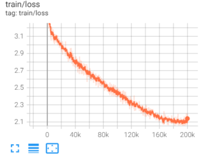
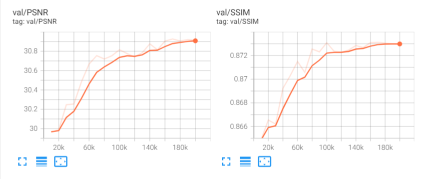
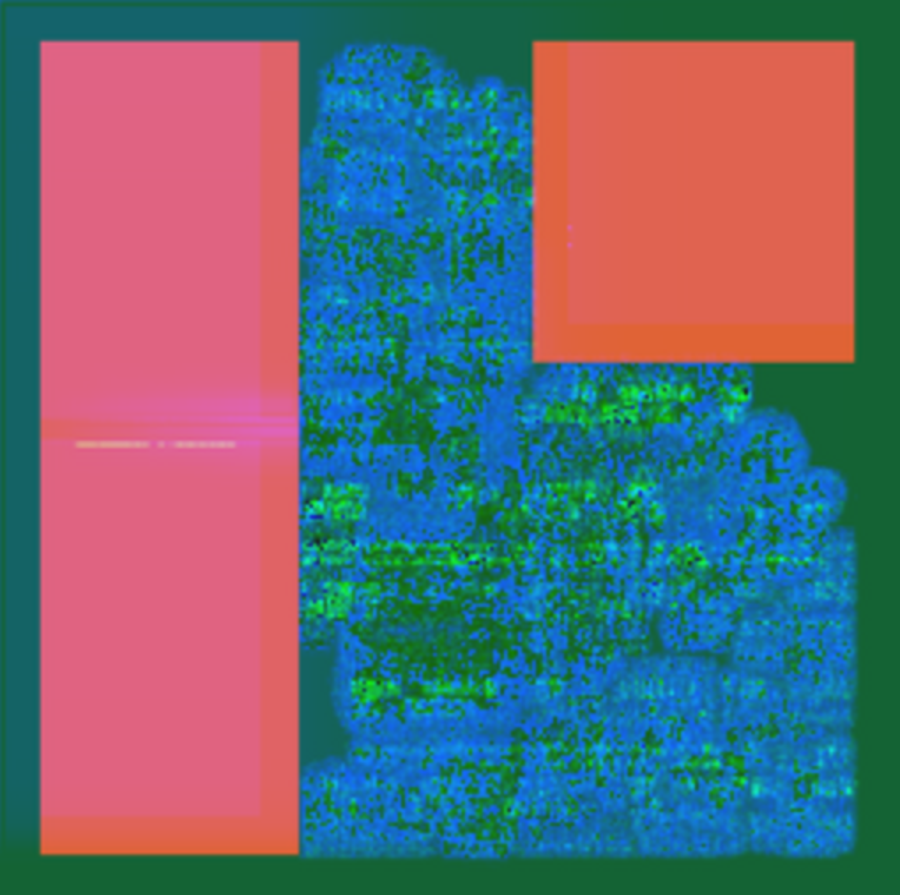
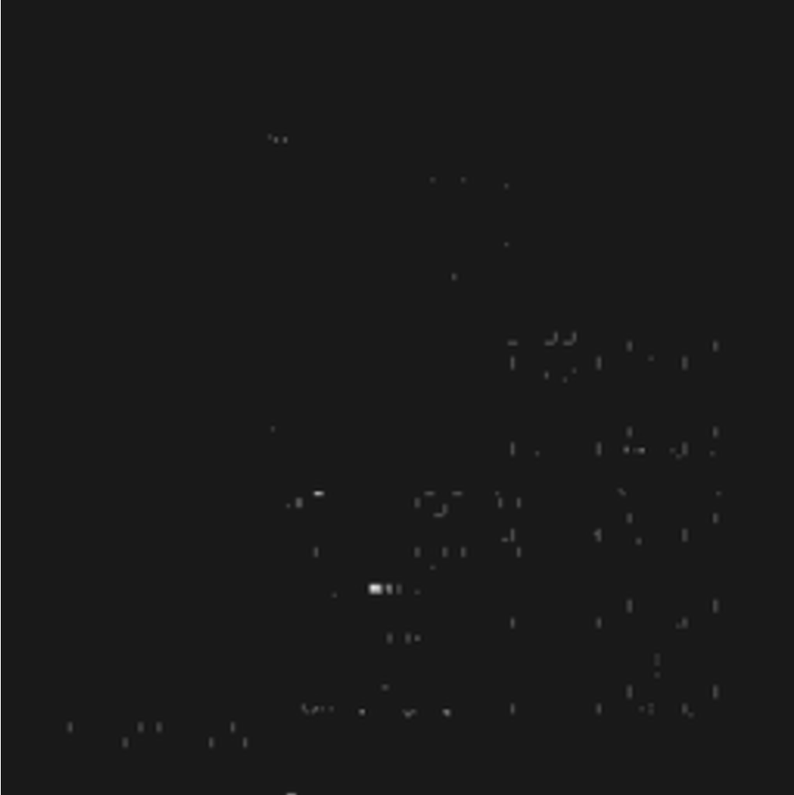
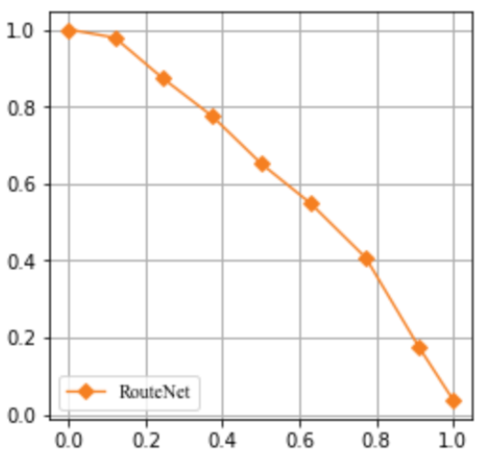
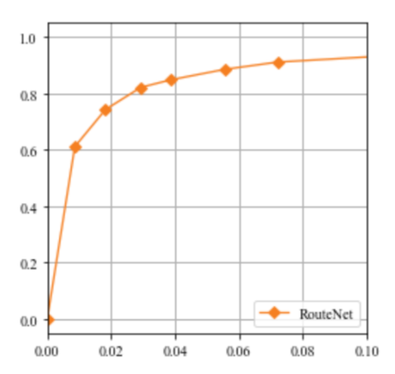
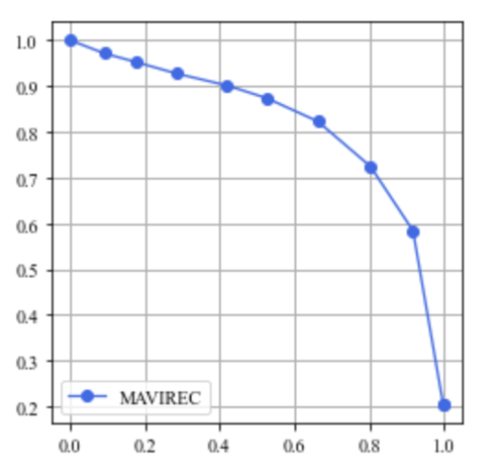

## Tutorial

------

Here, we select several representative methods to give a brief introduction to applying machine learning to VLSI physical design cycle that provides an intuitive awareness of the functionality and practicability of `CircuirNet` to users.

### Congestion Prediction

The network of `Global Placement with Deep Learning-Enabled Explicit Routability Optimization` uses an encoder and decoder architecture to translate the image-like features into a routing resource assumption heat map (congestion map). The architecture is shown below.

<div align="center">
  
</div>


The generation network consists of two fundamental modules, encoder and decoder, which are designed according to the architecture illustrated in the above figure.

```python
class conv(nn.Module):
    def __init__(self, dim_in, dim_out, kernel_size=3, stride=1, padding=1, bias=True):
        super(conv, self).__init__()
        self.main = nn.Sequential(
            nn.Conv2d(dim_in, dim_out, kernel_size=kernel_size, stride=stride, padding=padding, bias=bias),
            nn.InstanceNorm2d(dim_out, affine=True),
            nn.LeakyReLU(0.2, inplace=True),
            nn.Conv2d(dim_out, dim_out, kernel_size=kernel_size, stride=stride, padding=padding, bias=bias),
            nn.InstanceNorm2d(dim_out, affine=True),
            nn.LeakyReLU(0.2, inplace=True),
        )

    def forward(self, input):
        return self.main(input)

class upconv(nn.Module):
    def __init__(self, dim_in, dim_out):
        super(upconv, self).__init__()
        self.main = nn.Sequential(
                nn.ConvTranspose2d(dim_in, dim_out, 4, 2, 1),
                nn.InstanceNorm2d(dim_out, affine=True),
                nn.LeakyReLU(0.2, inplace=True),
                )

    def forward(self, input):
        return self.main(input)

class Encoder(nn.Module):
    def __init__(self, in_dim=3, out_dim=32):
        super(Encoder, self).__init__()
        self.in_dim = in_dim
        self.c1 = conv(in_dim, 32)
        self.pool1 = nn.MaxPool2d(kernel_size=2,stride=2)
        self.c2 = conv(32, 64)
        self.pool2 = nn.MaxPool2d(kernel_size=2,stride=2)
        self.c3 = nn.Sequential(
                nn.Conv2d(64, out_dim, 3, 1, 1),
                nn.BatchNorm2d(out_dim),
                nn.Tanh()
                )

    def init_weights(self):
        generation_init_weights(self)
        

    def forward(self, input):
        h1 = self.c1(input)
        h2 = self.pool1(h1)
        h3 = self.c2(h2)
        h4 = self.pool2(h3)
        h5 = self.c3(h4)
        return h5, h2  # shortpath from 2->7


class Decoder(nn.Module):
    def __init__(self, out_dim=2, in_dim=32):
        super(Decoder, self).__init__()
        self.conv1 = conv(in_dim, 32)
        self.upc1 = upconv(32, 16)
        self.conv2 = conv(16, 16)
        self.upc2 = upconv(32+16, 4)
        self.conv3 =  nn.Sequential(
                nn.Conv2d(4, out_dim, 3, 1, 1),
                nn.Sigmoid()
                )

    def init_weights(self):
        generation_init_weights(self)

    def forward(self, input):
        feature, skip = input
        d1 = self.conv1(feature)
        d2 = self.upc1(d1)
        d3 = self.conv2(d2)
        d4 = self.upc2(torch.cat([d3, skip], dim=1))
        output = self.conv3(d4)  # shortpath from 2->7
        return output  return self.main(input)
```

Three image-like features of RUDY, PinRUDY and MacroRegion were fed into the network to get the final congestion prediction. Here is the visualization of input features.

<div align="center">
  
</div>


We train this network in an end-to-end manner and compute the loss between the output and the golden result obtained by Innovus global router. 

```python
class GPDL(nn.Module):
    def __init__(self,
                 in_channels=3,
                 out_channels=2,
                 **kwargs):
        super().__init__()

        self.encoder = Encoder(in_dim=in_channels)
        self.decoder = Decoder(out_dim=out_channels)

    def forward(self, x):
        x = self.encoder(x)
        return self.decoder(x)

    def init_weights(self, pretrained=None, pretrained_transfer=None, strict=False, **kwargs):
        if isinstance(pretrained, str):
            new_dict = OrderedDict()
            weight = torch.load(pretrained, map_location='cpu')['state_dict']
            for k in weight.keys():
                new_dict[k] = weight[k]
            load_state_dict(self, new_dict, strict=strict, logger=None)
        elif pretrained is None:
            generation_init_weights(
                self, init_type=self.init_type, init_gain=self.init_gain)
        else:
            raise TypeError("'pretrained' must be a str or None. "
                            f'But received {type(pretrained)}.')
```


Training loss and evaluation metrics are presented below.

<div align="center">
  
</div>


<div align="center">
  
</div>


After finishing the training procedure, we dump the visualization of the congestion prediction map. The parts with high-contrast indicate the congestion hotspot.

<div align="center">
  
</div>


### DRC Violation

DRC Violation prediction is an essential step in the physical design procedure aiming at detecting violation hotspots at the early design stage, which is quite conducive to reducing the chip design turn-around. `RouteNet: Routability Prediction for Mixed-Size Designs Using Convolutional Neural Network` is a typical method for accurately detecting violation hotspots.

<div align="center">
  
</div>

Nine features extracted at different stages of physical design flow are combined together as one input tensor.

<div align="center">
  
</div>

After finishing the training phase, the prediction map can be specially demonstrated into a binary matrix, where the area greater than zero depicts the potential DRC violation in designing space.

<div align="center">
  
</div>

ROC and PRC are also provided to measure the performance of the abovementioned method.

<div align="center">
   
</div>

### IR Drop

IR Drop is another critical part of the whole design workflow that hugely affects the timing frequency and availability that needed to be carefully considered. `MAVIREC: ML-Aided Vectored IR-Drop Estimation and Classification` also cast the IR Drop prediction problem as an image-to-image translation task. Due to the demand for joint perception along the temporal and spatial axis, MAVIREC introduces a 3D encoder to aggregate the Spatio-temporal features and decode the prediction result into a 2D hotspot map.

<div align="center">
  
</div>

Here is the visualization of input features.

<div align="center">
  
</div>

The training phase is stopped after the network is sufficiently capable to generate a high-quality prediction map. We also use a binary map to indicate IR Drop hotspot.

<div align="center">
  
</div>

ROC and PRC are used as assessment indices to evaluate prediction results.

<div align="center">
   
</div>
