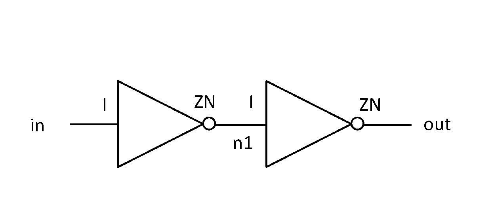

# Graph Features

To enable application for graph based methods, we further provide 54 gate-level netlists and 10242 instance placement information.

## Gate-level Netlist and extracted graph information

The gate-level netlists are the ones used in data generation. They are synthesised from 6 RISC-V designs with commercial 28 nm library and Synopsys Design Compiler(DC) with multiple variations. (see page [Feature](https://circuitnet.github.io/feature/properties.html) for detailed information about variations) The name of standard cell and IP is encrypted due to copyright issue. 

There are 2 version of netlist, one is the original hierarchical version written by DC, and the other one is the flatten version written by Innovus for extracting graph.

**For ease of use, we extract the necessary information for forming graph from the flatten netlist** They are saved in the form of numpy array.

(1) **Pin Attributes**: pin names, corresponding node index, net index.

(2) **Node Attributes**: node(instance) name, corresponding standard cell / IP name.

(3) **Net Attributes**: net name.

The array can be loaded with

`numpy.load(FILE_NAME, allow_pickle=True)`

Here is a simple example:

  

Pin Attributes: [[I,ZN,I,ZN], [0,0,1,1], [0,1,1,2]]

Node Attributes：[[inv_1, inv_2],[INV,INV]]

Net Attributes: [[in, n1, out]]

In this way, an adjacency matrix can be formulated through traversing the pin attributes array.

## Instance Placement

The instance, i.e., standard cell and IP, is placed at certain location on layout after placement stage in back-end design. 

The placement information for each layout, i.e., the location of instances, is extracted from def and saved as a dictionary. It contains the name of instance (consistent with the ones in netlist) and the coordination for the bounding box of instance on layout. 

e.g., InstanceN : [left, bottom, right, top]

The coordinate is the same as the one in the image-like feature.

The dictionary can be loaded with

`numpy.load(FILE_NAME, allow_pickle=True).item()`

The placement information can be added into node attributes through indexing, since there is one-to-one correspondence between the node name from the node attribute array above and the keys in the instance placement dictionary.

