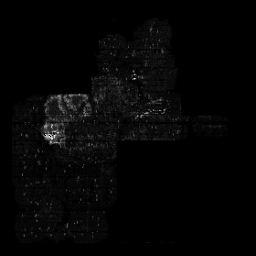
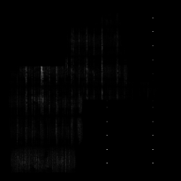

# IR Drop Features

## Power Maps

Including 5 component：1. internal power $$P_i$$, 2. switching power $$P_s$$, 3. toggle rate scaled power $$P_{sca}$$, 4. all $$P_{all}$$, 5. time-decomposed $$P_t$$. They are generated with power report and timing window report from Innovus. 

(1) Power report contains instance level power and toggles rate from a vectorless power analysis. 
- Internal power ($$p_i$$)
- Switching power ($$p_s$$)
- Leakage power ($$p_l$$)
- Toggles rate ($$r_{tog}$$)

Then these instance level power is merged into corresponding tile to form power maps.

$$ P_i \propto p_i$$

$$ P_s \propto p_s$$

$$ P_{sca} \propto (p_i+p_s) \times r_{tog}+p_l$$

$$ P_{all} \propto p_i+p_s+p_l$$

(2) Timing window report contains possible switching time domain of the instance in a clock period from a static timing analysis for each pin. The clock period is decomposed evenly into 20 parts, and the cell contributes to power map $$P_t$$ only in the parts that it is switching. 

$$ P_t[0,19] \propto p_{sca}$$

  

## IR Drop Map

IR drop value on each node from a vectorless power rail analysis is merged into corresponding tile to form IR drop maps.

  

