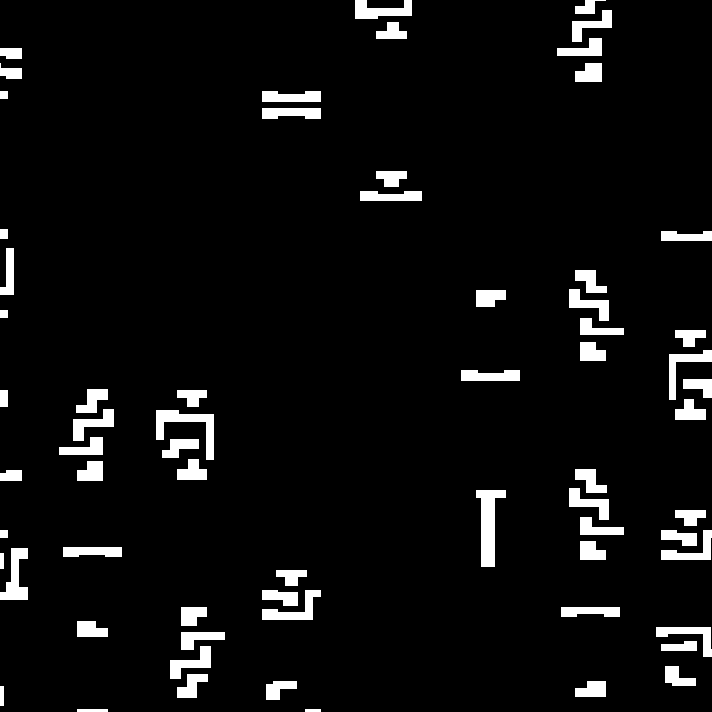

# Routability Features

## Macro Region &#9312;
The region on the layout covered by macro which shows the relative routing resource distribution.
Region covered and uncovered by macro denoted as different grey scale, 1 and 0, respectively.

	

## Cell Density &#9313;
Density distribution of cells, which is equivalent to the cell counts in each tile.

	

## Congestion &#9314; ~ &#9321;

<table class="tg">
<thead>
  <tr>
    <th class="tg-c3ow">name</th>
    <th class="tg-c3ow">computation apporach</th>
    <th class="tg-c3ow">stage</th>
    <th class="tg-c3ow">direction</th>
    <th class="tg-c3ow">used task</th>
  </tr>
</thead>
<tbody>
  <tr>
    <td class="tg-c3ow">congestion_eGR_horizontal_overflow &#9314;</td>
    <td class="tg-c3ow" rowspan="4">    overflow</td>
    <td class="tg-c3ow" rowspan="2"> early global routing </td>
    <td class="tg-c3ow">horizontal</td>
    <td class="tg-c3ow" rowspan="4">   Congestion/DRC</td>
  </tr>
  <tr>
    <td class="tg-c3ow">congestion_eGR_vertical_overflow &#9315;</td>
    <td class="tg-c3ow">vertical</td>
  </tr>
  <tr>
    <td class="tg-c3ow">congestion_GR_horizontal_overflow &#9316;</td>
    <td class="tg-c3ow" rowspan="2"> global routing </td>
    <td class="tg-c3ow">horizontal</td>
  </tr>
  <tr>
    <td class="tg-c3ow">congestion_GR_vertical_overflow &#9317;</td>
    <td class="tg-c3ow">vertical</td>
  </tr>
  <tr>
    <td class="tg-c3ow">congestion_eGR_horizontal_util &#9318;</td>
    <td class="tg-c3ow" rowspan="4">   utilization</td>
    <td class="tg-c3ow" rowspan="2"> early global routing</td>
    <td class="tg-c3ow">horizontal</td>
    <td class="tg-c3ow" rowspan="4">    none</td>
  </tr>
  <tr>
    <td class="tg-c3ow">congestion_eGR_vertical_util &#9319;</td>
    <td class="tg-c3ow">vertical</td>
  </tr>
  <tr>
    <td class="tg-c3ow">congestion_GR_horizontal_util &#9320;</td>
    <td class="tg-c3ow" rowspan="2"> global routing</td>
    <td class="tg-c3ow">horizontal</td>
  </tr>
  <tr>
    <td class="tg-c3ow">congestion_GR_vertical_util &#9321;</td>
    <td class="tg-c3ow">vertical</td>
  </tr>
</tbody>
</table>

- Computation method: 
  
  Congestion is computed based on the routing resources reported by Innovus, and there are 2 computation method, overflow based and utilization based. The report basically contains 3 information: total tracks, remain tracks and overflow, based on each GCell, aka tile. Wires have to be routed on tracks, thus tracks are equivalent to routing resources. 

  Overflow based congestion is computed as $$\frac{overflow}{total tracks}$$. Overflow is the extra demand over total tracks and reflects where congestion occurs.

  Utilization based congestion is computed as $$\frac{remain tracks}{total tracks}$$. Utilization reflects the distribution of routing resources.

- Stage: 
  Congestion is reported by Innovus in 2 different stage, eGR and GR. eGR is early global routing, aka trial routing. It is done after placement as a quick and early estimation for congestion. GR is global routing, and the congestion is more accurate than eGR in this stage.

- Direction: 
  The tech lef we use is of type HVH, which meaning that the wires on M1 is horizontal, the ones on M2 is vertical and so on. In this way, the congestion is divided into 2 directions, horizontal and vertical.

  

## RUDY &#9322; ~ &#9326;

RUDY refers to Rectangular Uniform wire DensitY which works as a early routing demand estimation after placement.
There are several derivatives:
- RUDY &#9322;
- RUDY long &#9323;
- RUDY short &#9324;
- RUDY pin &#9325;
- RUDY pin long &#9326;

(1) For the $$k$$th net with bounding box  $$(x_{k,min}$$, $$x_{k,max}$$, $$y_{k,min}$$, $$y_{k,max})$$, its *RUDY* at tile $$(i,j)$$ with bounding box $$(x_{i,min}$$, $$x_{i,max}$$, $$y_{j,min}$$, $$_{j,max})$$  is defined as

$$ w_k = x_{k,max}-x_{k,min}$$

$$ h_k = y_{k,max}-y_{k,min}$$

$$ s_k = (min(x_{k,max}, x_{i,max})-max(x_{k,min}, x_{i,min})) \times (min(y_{k,max}, y_{j,max})-max(y_{k,min}, y_{j,min}))$$

$$ s_{ij} = (x_{i,max}-x_{i,min})\times (y_{j,max}-y_{j,min})$$

$$ RUDY_k(i,j) =  \frac{w_k + h_k}{w_k \times h_k} \frac{s_ij}{s_k}$$

where min()/max() return the smaller/larger value among 2 inputs, $$s_{ij}$$ is the area of tile $$(i,j)$$ and $$s_k$$ denotes the area of tile $$(i,j)$$ covered by net k.

(2) *RUDY long* and *RUDY short* are the decomposition of *RUDY*, concerning the length of net k. If net k covers more than 1 tile, it contributes to *RUDY long*. Otherwise, net k covers only 1 tile, then it contributes to *RUDY short*.

(3) *RUDY pin* is calculated on the basis of each pin and the net connected the pin, and it is in analog for pin density. For tile $$(i,j)$$, *RUDY pin* of a pin belonging to net k is calculated as

$$ RUDY pin(i,j) =  \frac{w_k + h_k}{w_k \times h_k}$$

*RUDY pin long* is defined in symmetry with *RUDY long* as the decomposition of *RUDY pin* , i.e., if net k covers more than 1 tile, its pins contributes to *RUDY pin long*. 

## DRC &#9327;
Design rule check violations counted in each tile. Different types of DRC are both saved together in one map and seperately saved.

  

<!-- ## Pin Configuration Map &#9328;
A high resolution representation of pin and routing blockage shapes that conveys pin accessibility in routing.

  

 -->