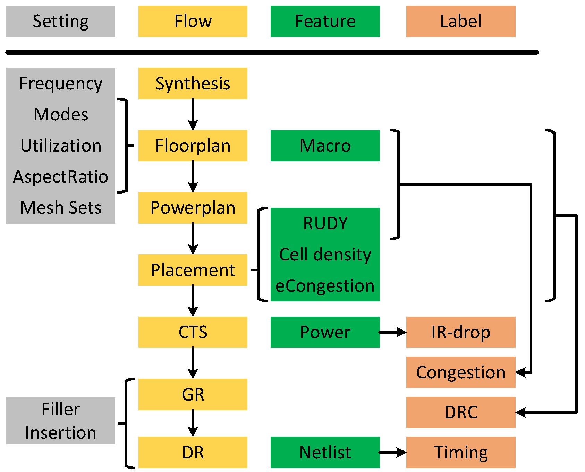

# Dataset Overview

The dataset provide multi-modal features, i.e., image and graph, to support for four cross-stage prediction tasks in back-end design: congestion prediction, DRC violations prediction, IR drop prediction and net delay prediction. For the first three tasks, the common practice is to leverage computer vision methods (e.g. CNN or FCN), thus the main part of CircuitNet for these tasks is 2D image-like data. In addition, for congestion prediction and net delay prediction, that can be completed on graph, we also provide graph features to support graph construction.

## Image-like Feature Maps

The information in layout is converted into image-like feature maps based on tiles of size 

2.25$$\mu$$m$$\times$$2.25$$\mu$$m, and they make up the main part of CircuitNet. 

- **Macro Region**:
   
  the regions covered by macros, used for estimation routing resources available in each tile.

- **Routability Features**:
  
  (1) Cell density: the cell number counted in each tile.

  (2) RUDY: a routing demand estimation for each net over spatial dimension. It is widely used for its high efficiency and accuracy. A variation named pin RUDY is also included as the pin density estimation.

  (3) Pin configuration:  a high resolution representation of pin and routing blockage shapes that conveys pin accessibility in routing.

  (4) Congestion: the overflow of routing demand in each tile.

  (5) DRC violations: the number of DRC violations in each tile.

- **IR Drop Features**:
  
  (1) Instance power: the instance level internal, switching and leakage power along with the toggles rate from a vectorless power analysis.

  (2) Signal arrival timing window: the possible switching time domain of the instance in a clock period from a static timing analysis for each pin.

  (3) IR drop: the IR drop value on each node from a vectorless power rail analysis.

## Graph Features

The connectivity of the design along with possible node and edge features are saved to enable prediction tasks on graph. See the [graph feature page](https://circuitnet.github.io/feature/graph.html) for more detailed descriptions. 

- **Graph Features from Netlist after Synthesis**:
  
    This is intended for GNN based congestion prediction. We provide the pin to cell and pin to net mapping from the netlist to enable graph construction and the instance (cell) placement (in both micron and Gcell coordinate) as cell features.

- **Graph Features from SDF (standard delay format)**:
  
    This is intended for GNN based net delay prediction. We provide the pin oriented graph from the SDF file and pin positions as node features.

## Supported Prediction Tasks

### Congestion Prediction
Predict congestion at post-placement stages.

Input features:
- For CNN: Macro Region, RUDY, Pin RUDY
- For GNN: Instance Placement 
  
Label:

Congestion

### DRC Violations Prediction
Predict DRC violations at post-global-routing stages.

Input features:
- Macro region
- RUDY
- Pin RUDY
- Cell density
- Congestion
<!-- - Pin Configuration (for J-Net) -->

Label:

DRC violations

### IR Drop Prediction
Predict IR drop at post-CTS stages.

Input features:

Spatial and temporal power maps

Label:

IR drop

### Net Delay Prediction
Predict net delay after routing at post-placement stages.

Input features:

Pin positions

Label:

Net delay