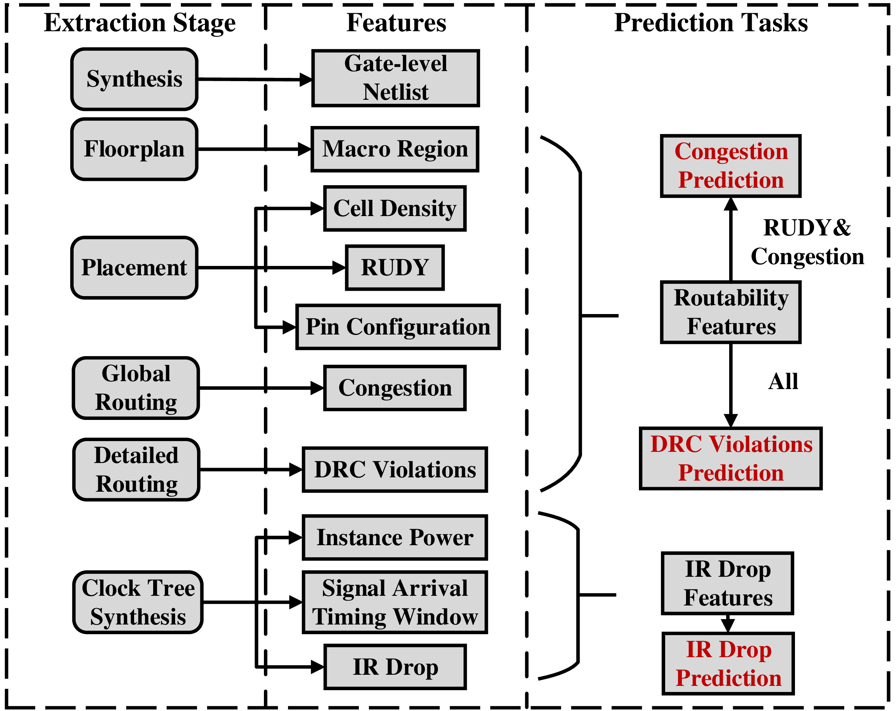

# Dataset Overview

The dataset now mainly provide support for three cross-stage prediction tasks in back-end design: congestion prediction, DRC violations prediction and IR drop prediction. The common practice in these tasks is to leverage computer vision methods(e.g. CNN or FCN), thus the main part of CircuitNet is 2D image-like data.

## Image-like Feature Maps

The information on layout is converted into image-like feature maps based on tiles of size 

1.5$$\mu$$m$$\times$$1.5$$\mu$$m, and they make up the main part of CircuitNet. 

- **Macro Region**:
   
  the regions covered by macros, used for estimation routing resources available in each tile.

- **Routability Features**:
  
  (1) Cell density: the cell number counted in each tile.

  (2) RUDY: a routing demand estimation for each net over spatial dimension. It is widely used for its high efficiency and accuracy. A variation named pin RUDY is also included as the pin density estimation.

  (3) Pin configuration:  a high resolution representation of pin and routing blockage shapes that conveys pin accessibility in routing.

  (4) Congestion: the overflow of routing demand in each tile.

  (5) DRC violations: the number of DRC violations in each tile.

- **IR Drop Features**:
  
  (1) Instance power: the instance level internal, switching and leakage power along with the toggles rate from a vectorless power analysis.

  (2) Signal arrival timing window: the possible switching time domain of the instance in a clock period from a static timing analysis for each pin.

  (3) IR drop: the IR drop value on each node from a vectorless power rail analysis.

## Supported Predition Tasks

### Congestion Prediction
Predict congestion at post-placement stages.
Input features:
- Macro region
- RUDY
- Pin RUDY
  
Label:
Congestion

### DRC Violations Prediction
Predict DRC violations at post-global-routing stages.
Input features:
- Macro region
- RUDY
- Pin RUDY
- Cell density
- Congestion
<!-- - Pin Configuration (for J-Net) -->

Label:
DRC violations

### IR Drop Prediction
Predict IR drop at post-CTS stages.

Input features:

Spatial and temporal power maps

Label:

IR drop

