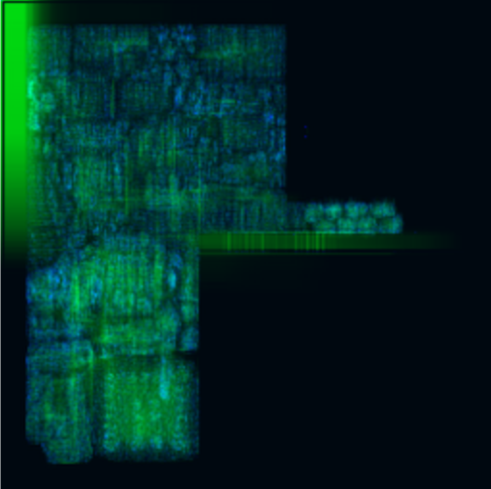
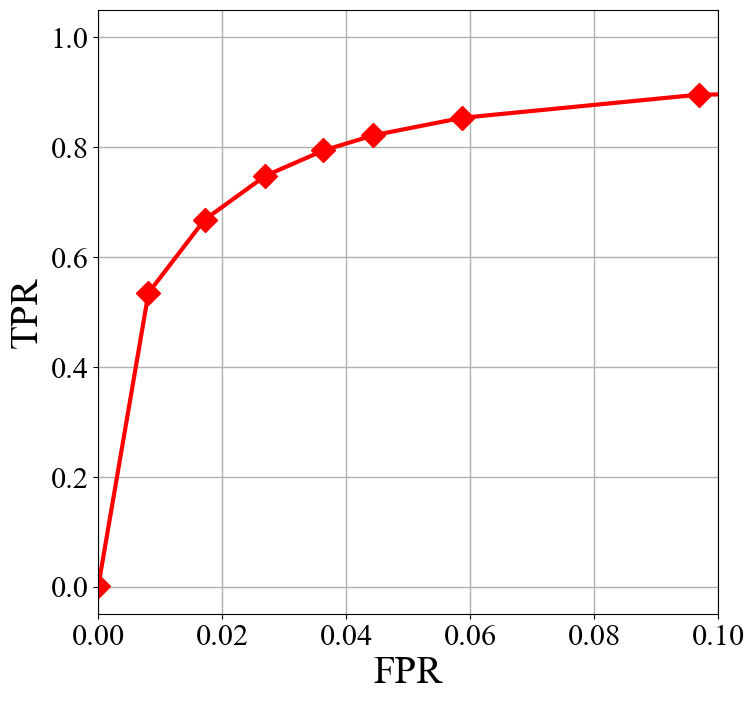
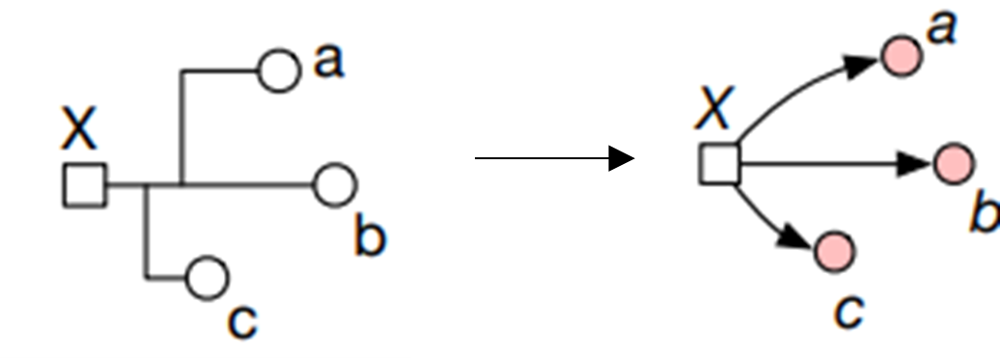

## Tutorial

------

Herein, we select several representative methods to give a brief introduction of applying machine learning to VLSI physical design cycle that provides an intuitive awareness of the functionality and practicability of `CircuirNet` to users. Please refer to our github repository [https://github.com/circuitnet/CircuitNet](https://github.com/circuitnet/CircuitNet) for the entire example. 

Note that all three selected methods utilize image-like features to train a generative model, such as fully convolutional networks (FCNs) and U-Net, formulating the prediction task into an image-to-image translation task. We did our best to reproduce the experimental environment in the original paper, including model architecture, feature selection and loss. The name of the features are matched with the ones in CircuitNet to avoid confusion.

### Congestion Prediction <div id="Congestion"></div>

Congestion is defined as the overflow of routing demand over available routing resource in the routing stage of the back-end design. It is frequently adopted as the metric to evaluate routability, i.e., the prospective quality of routing based on the current design solution. 
The congestion prediction is necessary to guide the optimization in placement stage and reduce total turn-around time.

The network of `Global Placement with Deep Learning-Enabled Explicit Routability Optimization` [1] uses an FCN based encoder-decoder architecture to translate the image-like features into a congestion map. The architecture is shown in Fig 1.

<div align="center">
  
  <br>
  <b>Fig 1</b> Model architecture.
</div>


The generation network consists of two fundamental modules, encoder and decoder, which are designed according to the architecture illustrated in Fig 1.

```python
class conv(nn.Module):
    def __init__(self, dim_in, dim_out, kernel_size=3, stride=1, padding=1, bias=True):
        super(conv, self).__init__()
        self.main = nn.Sequential(
            nn.Conv2d(dim_in, dim_out, kernel_size=kernel_size, stride=stride, padding=padding, bias=bias),
            nn.InstanceNorm2d(dim_out, affine=True),
            nn.LeakyReLU(0.2, inplace=True),
            nn.Conv2d(dim_out, dim_out, kernel_size=kernel_size, stride=stride, padding=padding, bias=bias),
            nn.InstanceNorm2d(dim_out, affine=True),
            nn.LeakyReLU(0.2, inplace=True),
        )

    def forward(self, input):
        return self.main(input)

class upconv(nn.Module):
    def __init__(self, dim_in, dim_out):
        super(upconv, self).__init__()
        self.main = nn.Sequential(
                nn.ConvTranspose2d(dim_in, dim_out, 4, 2, 1),
                nn.InstanceNorm2d(dim_out, affine=True),
                nn.LeakyReLU(0.2, inplace=True),
                )

    def forward(self, input):
        return self.main(input)

class Encoder(nn.Module):
    def __init__(self, in_dim=3, out_dim=32):
        super(Encoder, self).__init__()
        self.in_dim = in_dim
        self.c1 = conv(in_dim, 32)
        self.pool1 = nn.MaxPool2d(kernel_size=2,stride=2)
        self.c2 = conv(32, 64)
        self.pool2 = nn.MaxPool2d(kernel_size=2,stride=2)
        self.c3 = nn.Sequential(
                nn.Conv2d(64, out_dim, 3, 1, 1),
                nn.BatchNorm2d(out_dim),
                nn.Tanh()
                )

    def init_weights(self):
        generation_init_weights(self)
        

    def forward(self, input):
        h1 = self.c1(input)
        h2 = self.pool1(h1)
        h3 = self.c2(h2)
        h4 = self.pool2(h3)
        h5 = self.c3(h4)
        return h5, h2  # shortpath from 2->7


class Decoder(nn.Module):
    def __init__(self, out_dim=2, in_dim=32):
        super(Decoder, self).__init__()
        self.conv1 = conv(in_dim, 32)
        self.upc1 = upconv(32, 16)
        self.conv2 = conv(16, 16)
        self.upc2 = upconv(32+16, 4)
        self.conv3 =  nn.Sequential(
                nn.Conv2d(4, out_dim, 3, 1, 1),
                nn.Sigmoid()
                )

    def init_weights(self):
        generation_init_weights(self)

    def forward(self, input):
        feature, skip = input
        d1 = self.conv1(feature)
        d2 = self.upc1(d1)
        d3 = self.conv2(d2)
        d4 = self.upc2(torch.cat([d3, skip], dim=1))
        output = self.conv3(d4)  # shortpath from 2->7
        return output
```

In this work, three features are selected as input features to feed into the model. The included features are (1)macro_region, (2)RUDY, (3)RUDY_pin, and they are preprocessed and combined together as one numpy array by the provided script `generate_training_set.py` (check the [download page](https://circuitnet.github.io/intro/download.html) for usage of the script). The visualization of the array is shown in Fig 2.

<div align="center">
  
  <br>
  <b>Fig 2</b> Visualization of the input numpy array.
</div>

We create a class called `CongestionDataset` to intake the numpy array of congestion feature and label, while reading and processing them through pytorch `DataLoader`.

```python
class CongestionDataset(object):
    def __init__(self, ann_file, dataroot, pipeline=None, test_mode=False, **kwargs):
        super().__init__()
        self.ann_file = ann_file
        self.dataroot = dataroot
        self.test_mode = test_mode
        if pipeline:
            self.pipeline = Compose(pipeline)
        else:
            self.pipeline = None

        self.data_infos = self.load_annotations()

    def load_annotations(self):
        data_infos = []
        with open(self.ann_file, 'r') as fin:
            for line in fin:
                feature, label = line.strip().split(',')
                if self.dataroot is not None:
                    feature_path = osp.join(self.dataroot, feature)
                    label_path = osp.join(self.dataroot, label)
                data_infos.append(dict(feature_path=feature_path, label_path=label_path))
        return data_infos

    def prepare_data(self, idx):
        results = copy.deepcopy(self.data_infos[idx])
        results['feature'] = np.load(results['feature_path'])
        results['label'] = np.load(results['label_path'])

        results = self.pipeline(results) if self.pipeline else results
        
        feature =  results['feature'].transpose(2, 0, 1).astype(np.float32)
        label = results['label'].transpose(2, 0, 1).astype(np.float32)

        return feature, label, results['label']

    def __len__(self):
        return len(self.data_infos)

    def __getitem__(self, idx):
        return self.prepare_data(idx)
```


We train this network in an end-to-end manner and compute the loss between the output and the golden congestion map, which are the features named congestion_GR_horizontal_overflow and congestion_GR_vertical_overflow from CircuitNet. 

```python
class GPDL(nn.Module):
    def __init__(self,
                 in_channels=3,
                 out_channels=2,
                 **kwargs):
        super().__init__()

        self.encoder = Encoder(in_dim=in_channels)
        self.decoder = Decoder(out_dim=out_channels)

    def forward(self, x):
        x = self.encoder(x)
        return self.decoder(x)

    def init_weights(self, pretrained=None, pretrained_transfer=None, strict=False, **kwargs):
        if isinstance(pretrained, str):
            new_dict = OrderedDict()
            weight = torch.load(pretrained, map_location='cpu')['state_dict']
            for k in weight.keys():
                new_dict[k] = weight[k]
            load_state_dict(self, new_dict, strict=strict, logger=None)
        elif pretrained is None:
            generation_init_weights(
                self, init_type=self.init_type, init_gain=self.init_gain)
        else:
            raise TypeError("'pretrained' must be a str or None. "
                            f'But received {type(pretrained)}.')
```


The model is trained for 200k iterations. The curve of loss versus training iterations are presented in Fig 3. 
<!-- The model is trained for 200k iterations. The curve of training loss and evaluation metrics in training are presented in Fig 3 and Fig 4.  -->
Normalized Root-Mean-Square-Error (NRMSE) and structure similarity index measure (SSIM) are used to evaluate pixel level accuracy, and the final result of these metrics are 0.04 and 0.80 respectively.

<div align="center">
  
    <br>
  <b>Fig 3</b> Training loss at different training iterations.
</div>


<!-- <div align="center">
  
    <br>
  <b>Fig 4</b> Evaluation metrics(PSNR, SSIM) at different training iterations.
</div> -->


After finishing the training procedure, we dump the visualization of the predicted congestion map, which is shown in Fig 4. The parts with high-contrast indicate the congestion hotspot.

<div align="center">
  
  <br>
  <b>Fig 4</b> Visualization of the predicted congestion map.
</div>


### DRC Violation Prediction <div id="DRC"></div>

Design rule check (DRC) violation is another estimation for routability. The congestion is available after global routing, while DRC violation is reported after detailed routing. And there is a deviation between them at advanced tech node, such as 7 nm. Thus it is also necessary to predict DRC violations directly. `RouteNet: Routability Prediction for Mixed-Size Designs Using Convolutional Neural Network` [2] is a typical method for accurately predicting violation hotspots. The architecture is shown in Fig 5.

<div align="center">
  
  <br>
  <b>Fig 5</b> Model architecture.
</div>

The network is the same as the one in congestion prediction . 

```python
class conv(nn.Module):
    def __init__(self, dim_in, dim_out, kernel_size=3, stride=1, padding=1, bias=True):
        super(conv, self).__init__()
        self.main = nn.Sequential(
            nn.Conv2d(dim_in, dim_out, kernel_size=kernel_size, stride=stride, padding=padding, bias=bias),
            nn.InstanceNorm2d(dim_out, affine=True),
            nn.LeakyReLU(0.2, inplace=True),
            nn.Conv2d(dim_out, dim_out, kernel_size=kernel_size, stride=stride, padding=padding, bias=bias),
            nn.InstanceNorm2d(dim_out, affine=True),
            nn.LeakyReLU(0.2, inplace=True),
        )

    def forward(self, input):
        return self.main(input)

class upconv(nn.Module):
    def __init__(self, dim_in, dim_out):
        super(upconv, self).__init__()
        self.main = nn.Sequential(
                nn.ConvTranspose2d(dim_in, dim_out, 4, 2, 1),
                nn.InstanceNorm2d(dim_out, affine=True),
                nn.LeakyReLU(0.2, inplace=True),
                )

    def forward(self, input):
        return self.main(input)

class Encoder(nn.Module):
    def __init__(self, in_dim=3, out_dim=32):
        super(Encoder, self).__init__()
        self.in_dim = in_dim
        self.c1 = conv(in_dim, 32)
        self.pool1 = nn.MaxPool2d(kernel_size=2,stride=2)
        self.c2 = conv(32, 64)
        self.pool2 = nn.MaxPool2d(kernel_size=2,stride=2)
        self.c3 = nn.Sequential(
                nn.Conv2d(64, out_dim, 3, 1, 1),
                nn.BatchNorm2d(out_dim),
                nn.Tanh()
                )

    def init_weights(self):
        generation_init_weights(self)
        

    def forward(self, input):
        h1 = self.c1(input)
        h2 = self.pool1(h1)
        h3 = self.c2(h2)
        h4 = self.pool2(h3)
        h5 = self.c3(h4)
        return h5, h2  # shortpath from 2->7


class Decoder(nn.Module):
    def __init__(self, out_dim=2, in_dim=32):
        super(Decoder, self).__init__()
        self.conv1 = conv(in_dim, 32)
        self.upc1 = upconv(32, 16)
        self.conv2 = conv(16, 16)
        self.upc2 = upconv(32+16, 4)
        self.conv3 =  nn.Sequential(
                nn.Conv2d(4, out_dim, 3, 1, 1),
                nn.Sigmoid()
                )

    def init_weights(self):
        generation_init_weights(self)

    def forward(self, input):
        feature, skip = input
        d1 = self.conv1(feature)
        d2 = self.upc1(d1)
        d3 = self.conv2(d2)
        d4 = self.upc2(torch.cat([d3, skip], dim=1))
        output = self.conv3(d4)  # shortpath from 2->7
        return output
```

In this work, nine features are selected as input features to feed into the model. The included features are (1)macro_region, (2)cell_density, (3)RUDY_long, (4)RUDY_short, (5)RUDY_pin_long, (6)congestion_eGR_horizontal_overflow, (7)congestion_eGR_vertical_overflow, (8)congestion_GR_horizontal_overflow, (9)congestion_GR_vertical_overflow. Again, these features are preprocessed and combined together as one numpy array. The visualization of the array is shown in Fig 6.

<div align="center">
  
    <br>
  <b>Fig 6</b> Visualization of the input numpy array.
</div>

We create a class called `DRCDataset` to intake the numpy array of congestion feature and label, while reading and processing them through pytorch `DataLoader`.

```python
class DRCDataset(object):
    def __init__(self, ann_file, dataroot, test_mode=None, **kwargs):
        super().__init__()
        self.ann_file = ann_file
        self.dataroot = dataroot
        self.test_mode = test_mode
        self.data_infos = self.load_annotations()

    def load_annotations(self):
        data_infos = []
        with open(self.ann_file, 'r') as fin:
            for line in fin:
                feature, label = line.strip().split(',')
                if self.dataroot is not None:
                    feature_path = osp.join(self.dataroot, feature)
                    label_path = osp.join(self.dataroot, label)
                data_infos.append(dict(feature_path=feature_path, label_path=label_path))
        return data_infos

    def prepare_data(self, idx):
        results = copy.deepcopy(self.data_infos[idx])

        feature = np.load(results['feature_path']).transpose(2, 0, 1).astype(np.float32)
        label = np.load(results['label_path']).transpose(2, 0, 1).astype(np.float32)

        return feature, label, results['label_path']

    def __len__(self):
        return len(self.data_infos)

    def __getitem__(self, idx):
        return self.prepare_data(idx)
```
We train this network in an end-to-end manner and compute the loss between the output and the golden DRC violations map, which is the feature named DRC_all from CircuitNet. 

```python
class RouteNet(nn.Module):
    def __init__(self,
                 in_channels=9,
                 out_channels=2,
                 **kwargs):
        super().__init__()

        self.encoder = Encoder(in_dim=in_channels)
        self.decoder = Decoder(out_dim=out_channels)

    def forward(self, x):
        x = self.encoder(x)
        return self.decoder(x)

    def init_weights(self, pretrained=None, pretrained_transfer=None, strict=False, **kwargs):
        if isinstance(pretrained, str):
            new_dict = OrderedDict()
            weight = torch.load(pretrained, map_location='cpu')['state_dict']
            for k in weight.keys():
                new_dict[k] = weight[k]

            new_dict_clone = new_dict.copy()
            for key, value in new_dict_clone.items():
                if key.endswith(('running_mean', 'running_var')):
                    del new_dict[key]
    
            load_state_dict(self, new_dict, strict=strict, logger=None)
        elif pretrained is None:
            generation_init_weights(
                self, init_type=self.init_type, init_gain=self.init_gain)
        else:
            raise TypeError("'pretrained' must be a str or None. "
                            f'But received {type(pretrained)}.')
```
The model is trained for 200k iterations. The curve of training loss is presented in Fig 7.

<div align="center">
  
    <br>
  <b>Fig 7</b> Training loss at different training iterations.
</div>


The DRC violations map provides the number of DRC violations in each tile, i.e., in each Gcell in the layout. The visualization of the DRC violations map is shown in Fig 8.

<div align="center">
  
    <br>
  <b>Fig 8</b> Visualization of the DRC violations map.
</div>
In this work, the tiles have number of violations exceeding the threshold are regarded as hotspots. The hotspots are much less than non-hotspot, which is imbalanced, thus the evaluation metric, receiver operating characteristic (ROC) curve, is adopted to evaluate the performance of the method. The result is shown in Fig 9. 

<div align="center">
  =
    <br>
  <b>Fig 9</b> ROC curve.
</div>

### IR Drop Prediction <div id="IR"></div>

IR drop is defined as deviation of voltage from reference (VDD,
VSS) and it has to be restricted to avoid degradation in timing and
functionality. `MAVIREC: ML-Aided Vectored IR-Drop Estimation and Classification` [3] utilizes a U-Net based network to predict IR drop. Due to the demand for joint perception along the temporal and spatial axis, MAVIREC introduces a 3D encoder to aggregate the spatio-temporal features and output the prediction result as a 2D IR drop map.

<div align="center">
  
    <br>
  <b>Fig 10</b> Model architecture.
</div>

The generation network consists of two fundamental modules, encoder and decoder, which are designed according to the architecture illustrated in Fig 10.

```python
class DoubleConv3d(nn.Module):
    """(convolution => [BN] => ReLU) * 2"""

    def __init__(self, in_channels, out_channels, mid_channels=None):
        super().__init__()
        if not mid_channels:
            mid_channels = out_channels
        self.double_conv = nn.Sequential(
            nn.Conv3d(in_channels, mid_channels, kernel_size=3, padding=(0, 1, 1), bias=False),
            nn.BatchNorm3d(mid_channels),
            nn.ReLU(inplace=True),
            nn.Conv3d(mid_channels, out_channels, kernel_size=3, padding=(0, 1, 1), bias=False),
            nn.BatchNorm3d(out_channels),
            nn.ReLU(inplace=True)
        )

    def forward(self, x):
        return self.double_conv(x)


class DoubleConv2d(nn.Module):
    """(convolution => [BN] => ReLU) * 2"""

    def __init__(self, in_channels, out_channels, mid_channels=None):
        super().__init__()
        if not mid_channels:
            mid_channels = out_channels
        self.double_conv = nn.Sequential(
            nn.Conv2d(in_channels, mid_channels, kernel_size=3, padding=1, bias=False),
            nn.BatchNorm2d(mid_channels),
            nn.ReLU(inplace=True),
            nn.Conv2d(mid_channels, out_channels, kernel_size=3, padding=1, bias=False),
            nn.BatchNorm2d(out_channels),
            nn.ReLU(inplace=True)
        )

    def forward(self, x):
        return self.double_conv(x)


class Down(nn.Module):
    """Downscaling with maxpool then double conv"""

    def __init__(self, in_channels, out_channels):
        super().__init__()
        self.maxpool_conv = nn.Sequential(
            nn.MaxPool3d((1, 2, 2), stride=(1, 2, 2)),
            DoubleConv3d(in_channels, out_channels)
        )

    def forward(self, x):
        return self.maxpool_conv(x)


class Up(nn.Module):
    """Upscaling then double conv"""

    def __init__(self, in_channels, out_channels, bilinear=True):
        super().__init__()

        # if bilinear, use the normal convolutions to reduce the number of channels
        if bilinear:
            self.up = nn.Upsample(scale_factor=2, mode='bilinear', align_corners=True)
            self.conv = DoubleConv2d(in_channels, out_channels, in_channels // 2)
        else:
            self.up = nn.ConvTranspose2d(in_channels, in_channels // 2, kernel_size=2, stride=2)
            self.conv = DoubleConv2d(in_channels, out_channels)

    def forward(self, x1, x2):
        x1 = self.up(x1)
        # input is CHW
        diffY = x2.size()[2] - x1.size()[2]
        diffX = x2.size()[3] - x1.size()[3]

        x1 = F.pad(x1, [diffX // 2, diffX - diffX // 2,
                        diffY // 2, diffY - diffY // 2])
        x = torch.cat([x2, x1], dim=1)
        return self.conv(x)


class OutConv(nn.Module):
    def __init__(self, in_channels, out_channels):
        super(OutConv, self).__init__()
        self.conv = nn.Conv2d(in_channels, out_channels, kernel_size=1)

    def forward(self, x):
        return self.conv(x)
```


In this work, five features are selected as input features to feed into the model. The included features are (1)power_i, (2)power_s, (3)power_sca, (4)power_all, (5)power_t. Again, these features are preprocessed and combined together as one numpy array. The visualization of the array is shown in Fig 11.


<div align="center">
  
    <br>
  <b>Fig 11</b> Visualization of input numpy array.
</div>

We create a class called `IRDropDataset` to intake the numpy array of congestion feature and label, while reading and processing them through pytorch `DataLoader`.

```python
class IRDropDataset(object):
    def __init__(self, ann_file, dataroot, test_mode=False, **kwargs):
        super().__init__()
        self.ann_file = ann_file
        self.dataroot = dataroot
        self.test_mode = test_mode
        self.data_infos = self.load_annotations()

        self.temporal_key = 'Power_t'

    def load_annotations(self):  
        data_infos = []
        with open(self.ann_file, 'r') as fin:
            for line in fin:
                infos = line.strip().split(',')
                label = infos[-1]
                features = infos[:-1]
                info_dict = dict()
                if self.dataroot is not None:
                    for feature in features:
                        info_dict[feature.split('/')[0]] = osp.join(self.dataroot, feature)
                    feature_path = info_dict
                    label_path = osp.join(self.dataroot, label)
                data_infos.append(dict(feature_path=feature_path, label_path=label_path))
        return data_infos

    def prepare_data(self, idx):
        results = copy.deepcopy(self.data_infos[idx])

        feature = np.load(results['feature_path']).transpose(2, 0, 1).astype(np.float32)
        feature = np.expand_dims(feature, axis=0)
        label = np.load(results['label_path']).transpose(2, 0, 1).astype(np.float32).squeeze()
        return feature, label, results['label_path']


    def __len__(self):
        return len(self.data_infos)


    def __getitem__(self, idx):
        return self.prepare_data(idx)
```


We train this network in an end-to-end manner and compute the loss between the output and the golden IR drop map, which is the feature named ir_drop from CircuitNet. 

```python
class MAVI(nn.Module):
    def __init__(self, 
                 in_channels, 
                 out_channels, 
                 bilinear=False,
                 init_cfg=dict(type='normal', gain=0.02), 
                 **kwargs):
        super(MAVI, self).__init__()
        self.in_channels = in_channels
        self.out_channels = out_channels
        self.bilinear = bilinear

        self.inc = DoubleConv3d(in_channels, 64)
        self.down1 = Down(64, 128)
        self.down2 = Down(128, 256)
        self.down3 = Down(256, 512)
        factor = 2 if bilinear else 1

        self.up1 = Up(512, 256 // factor, bilinear)
        self.up2 = Up(256, 128 // factor, bilinear)
        self.up3 = Up(128, 64, bilinear)
        self.outc = OutConv(64, out_channels)

        self.init_type = 'normal' if init_cfg is None else init_cfg.get(
            'type', 'normal')
        self.init_gain = 0.02 if init_cfg is None else init_cfg.get(
            'gain', 0.02)

    def forward(self, x):
        x_in = x[:, :, :self.out_channels, :, :] # [b c 4 h w]
        x1 = self.inc(x)
        x2 = self.down1(x1)  # [1, 64, 20, 256, 256]
        x3 = self.down2(x2)  # [1, 128, 16, 128, 128]
        x4 = self.down3(x3)  # [1, 512, 12, 64, 64]

        x = self.up1(x4.mean(dim=2), x3.mean(dim=2))
        x = self.up2(x, x2.mean(dim=2))
        x = self.up3(x, x1.mean(dim=2))
        logits = self.outc(x)

        logits = x_in.squeeze(1)*logits
        return torch.sum(logits, dim=1)

    def init_weights(self, pretrained=None):
        if isinstance(pretrained, str):
            load_checkpoint(self, pretrained, strict=False, logger=None)
        elif pretrained is None:
            for m in self.modules():
                if isinstance(m, (nn.BatchNorm2d, nn.GroupNorm)):
                    constant_init(m.weight, 1)
                    constant_init(m.bias, 0)

                if isinstance(m, nn.Conv3d):
                    kaiming_init(m)
                elif isinstance(m, _BatchNorm):
                    constant_init(m, 1)
        else:
            raise TypeError(f'"pretrained" must be a str or None. '
                            f'But received {type(pretrained)}.')

```

The IR drop map provides the maximum IR drop value in each tile, i.e., in each Gcell in the layout. The visualization of the IR drop map is shown in Fig 12.

<div align="center">
  
    <br>
  <b>Fig 12</b> Visualization of the IR drop map.
</div>

The model is trained for 200k iterations. The curve of training loss is presented in Fig 13.

<div align="center">
  
    <br>
  <b>Fig 13</b> Training loss at different training iterations.
</div>

In this work, the tiles have IR drop value exceeding the threshold are regarded as hotspots. Thus, the same evaluation metric as the DRC violation prediction task, which is the ROC curve, is adopted to evaluate the performance of the method. The result is shown in Fig 14. 


<div align="center">
  
    <br>
  <b>Fig 14</b> ROC curve.
</div>


### Net Delay Prediction <div id="Net_Delay"></div>

Net Delay is the delay of signal on interconnect nets that derived from the parasitic capacitance and resistance. Calculating net delay is a curcial step in static timing analysis (STA), which is necessary in ensuring the correct functionallity of the sequential logic. But before detailed routing, like during placement, the precise net delay cannot be calculated, as the routing of the net has not been decided, so we need to predict net delay at pre-routing stages, and what we know is the positions of pins and the connectivity of the net. And on the other hand, predicting net delay is essentially predicting the routing of the net. 

In this task, our problem formulation is to predict net delay after detailed routing from the pin postions and net topology at placement stage.
During routing, a net is shown in Fig 15. It always has 1 source pin and can have 1 or multiple sink pins. During routing, a tree structured net will connect the source pin to all sink pins, and the structure of the net is related to all pin positions, because the tree is a Steiner tree and the Steiner point might be inserted near pin clusters. In addition, the net delay is the delay from the source pin to 1 sink pin.

So a graph neural network (GNN) can be used to exchange information within all nodes (pins) and predict net delay (can be a feature on edge).
The network is developed from the net embedding part of [the open source code](https://github.com/TimingPredict/TimingPredict) from `A Timing Engine Inspired Graph Neural Network Model for Pre-Routing Slack Prediction` [4]. 
<!-- More details can be viewed in our repository. -->

<div align="center">
  
  <br>
  <b>Fig 15</b> Illustration of a net.
</div>


Firstly, build a graph with the timing features, net_edges, nodes and pin_positions, from CircuitNet.

```python
import torch
import dgl
import numpy as np

net_edges = np.load('path to net_edges.npz')['net_edges']
nodes = np.load('path to nodes.npz')['nodes']
pin_positions = np.load('path to pin_positions.npz'), allow_pickle=True)['pin_positions'].item()

# build a bi-direction graph for bi-direction message passing
g = dgl.heterograph({
('node', 'net_out', 'node'): (net_edges[:,0], net_edges[:,1]),
('node', 'net_in', 'node'): (net_edges[:,1], net_edges[:,0]),
})

# assign net_delay to edge feature, which will be used as label in the following.
g.edges['net_out'].data['net_delay'] = torch.tensor(net_edges[:,2:]).type(torch.float32)

# assign pin_positions to node feature.
g.ndata['nf'] = torch.tensor([pin_positions[nodes[i.item()].replace('\\','')][0:4] for i in g.nodes()]).type(torch.float32)
g.edges['net_out'].data['net_delays_log'] = (torch.log(0.0001 + g.edges['net_out'].data['net_delay']) + 9.211) # log(0.0001) ≈ -9.211
```

Then, we define the GNN model.

```python
import torch.nn.functional as F
import dgl.function as fn

class MLP(torch.nn.Module):
    def __init__(self, *sizes, batchnorm=False):
        super().__init__()
        fcs = []
        for i in range(1, len(sizes)):
            fcs.append(torch.nn.Linear(sizes[i - 1], sizes[i]))
            if i < len(sizes) - 1:
                fcs.append(torch.nn.LeakyReLU(negative_slope=0.2))
                if batchnorm: fcs.append(torch.nn.BatchNorm1d(sizes[i]))
        self.layers = torch.nn.Sequential(*fcs)

    def forward(self, x):
        return self.layers(x)

class NetConv(torch.nn.Module):
    def __init__(self, in_nf, in_ef, out_nf, h1=16, h2=16):
        super().__init__()
        self.in_nf = in_nf
        self.in_ef = in_ef
        self.out_nf = out_nf
        self.h1 = h1
        self.h2 = h2
        self.MLP_msg_i2o = MLP(self.in_nf * 2 , 32, 32, 32, 1 + self.h1 + self.h2)
        self.MLP_reduce_o = MLP(self.in_nf + self.h1 + self.h2, 32, 32, 32, self.out_nf)
        self.MLP_msg_o2i = MLP(self.in_nf * 2, 32, 32, 32, 32, self.out_nf)
        self.MLP_readout = MLP(self.in_nf * 2, 32, 32, 32, 32, self.out_nf)

    def edge_msg_i(self, edges):
        x = torch.cat([edges.src['nf'], edges.dst['nf']], dim=1)
        x = self.MLP_msg_o2i(x)
        return {'efi': x}
    
    def edge_msg_o(self, edges):
        x = torch.cat([edges.src['nf'], edges.dst['nf']], dim=1)
        x = self.MLP_msg_i2o(x)
        k, f1, f2 = torch.split(x, [1, self.h1, self.h2], dim=1)
        k = torch.sigmoid(k)
        return {'efo1': f1 * k, 'efo2': f2 * k}

    def node_reduce_o(self, nodes):
        x = torch.cat([nodes.data['nf'], nodes.data['nfo1'], nodes.data['nfo2']], dim=1)
        x = self.MLP_reduce_o(x)
        return {'new_nf': x}

    def edge_readout(self, edges):
        x = torch.cat([edges.src['nf'], edges.dst['nf']], dim=1)
        x = self.MLP_readout(x)
        return {'nef': x}
    
    def forward(self, g, nf):
        with g.local_scope():
            g.ndata['nf'] = nf
            # input nodes
            g.apply_edges(self.edge_readout, etype='net_out')  # message passing from source to sink
            g.update_all(self.edge_msg_i, fn.sum('efi', 'new_nf'), etype='net_out') # read out net delay prediction
            # output nodes
            g.apply_edges(self.edge_msg_o, etype='net_in')     # message passing from sink to source
            g.update_all(fn.copy_e('efo1', 'efo1'), fn.sum('efo1', 'nfo1'), etype='net_in')
            g.update_all(fn.copy_e('efo2', 'efo2'), fn.max('efo2', 'nfo2'), etype='net_in')
            g.apply_nodes(self.node_reduce_o)
            
            return g.ndata['new_nf'], g.edges['net_out'].data['nef'] 

class NetDelayPrediction(torch.nn.Module):
    def __init__(self):
        super().__init__()
        self.nc1 = NetConv(4, 0, 16)
        self.nc2 = NetConv(16, 0, 16)
        self.nc3 = NetConv(16, 0, 4)

    def forward(self, g, groundtruth=False):
        nf0 = g.ndata['nf']
        x, _ = self.nc1(g, nf0)
        x, _ = self.nc2(g, x)
        _, net_delays = self.nc3(g, x)
        return net_delays
```

Finally, we can train the model with the graph we built.

```
model = NetDelayPrediction()
model.cuda()

optimizer = torch.optim.Adam(model.parameters(), lr=0.0005)
train_loss_tot_net_delays = 0
optimizer.zero_grad()

pred_net_delays= model(g, groundtruth=args.groundtruth)
loss_net_delays = 0

loss_net_delays = F.mse_loss(pred_net_delays, g.edges['net_out'].data['net_delays_log'])
train_loss_tot_net_delays += loss_net_delays.item()
loss_net_delays.backward()
optimizer.step()

```


# Citation
```
[1] S. Liu, et al. “Global Placement with Deep Learning- Enabled Explicit Routability Optimization,” in DATE 2021. 1821–1824.
      
[2] Z. Xie, et al. “RouteNet: Routability prediction for mixed-size designs using convolutional neural network,” in ICCAD 2018. 1–8.

[3] V. A. Chhabria, et al. “MAVIREC: ML-Aided Vectored IR-Drop Estimation and Classification,” in DATE 2021. 1825–1828.

[4] Z. Guo, et al. “A Timing Engine Inspired Graph Neural Network Model for Pre-Routing Slack Prediction,” in DATE 2021. 1825–1828.
,” in DAC 2022. 1207-1212. 
```